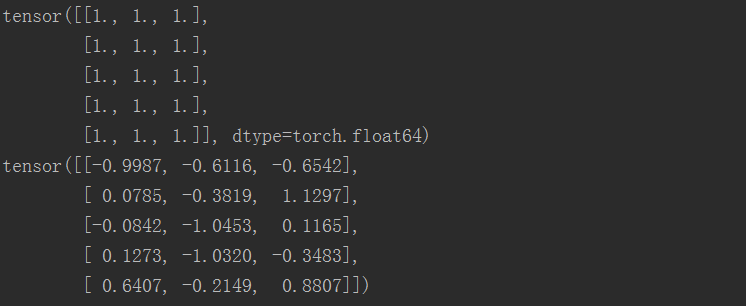

# Tensor

## 什么是Tensor
Tensor（张量）是PyTorch最基本的操作对象，表示的是一个多维的矩阵，比如零维就是一个点，一维就向量，二维就是一般的矩阵，多维就相当于一个多维的数组，与python的numpy是对应的，而且PyTorch的Tensor可以和numpy的ndarray相互转换，唯一不同的是PyTorch可以再GPU上运行，而numpy的ndarray只能在CPU上运行。
Tensor的基本数据类型包括
* 32位浮点型  torch.FloatTensor（默认）
* 64位浮点型 torch.DoubleTensor
* 16位整型  torch.ShortTensor
* 32位整型 torch.IntTensor
* 64位整型 torch.LongTensor

## Tensor的基本操作
### 引入torch包

```buildoutcfg
from __future__ import print_function
import torch
```
### 矩阵构建

<h4>1.构建一个5x3矩阵，不做初始化

```buildoutcfg
x = torch.empty(5, 3)
print(x)
```
输出结果：


<h4>2.构建随机初始化矩阵

```buildoutcfg
x = torch.rand(5, 3)
print(x)
```
输出结果：


<h4>3.构造一个long类型的矩阵，且全为0

```buildoutcfg
x = torch.zeros(5, 3, dtype=torch.long)
print(x)
```
输出结果：


<h4>4.创建张量，并自定义数据

```buildoutcfg
x = torch.tensor([5.5, 3])
print(x)
```
输出结果：


<h4>5.基于已有的tensor创建新的tensor

```buildoutcfg
x = x.new_ones(5, 3, dtype=torch.double)
print(x)

x = torch.randn_like(x, dtype=torch.float)
# 重写了数据类型
print(x)
# 矩阵的大小相同
```
输出结果：



<h4>6.获取张量的维度

```buildoutcfg
print(x.size())
```
输出结果：


<h4>7.张量的加法运算

<h5>(1)直接使用“+”运算符

```buildoutcfg
y = torch.rand(5, 3)
print(x + y)
```
<h5>(2)使用add()函数

```
print(torch.add(x, y))
```

<h5>(3)提供一个输出tensor作为参数

```buildoutcfg
result = torch.empty(5, 3)
torch.add(x, y, out=result)
print(result)
```
<h5>(4)使用add_()函数做加法，并取代原张量

```buildoutcfg
# adds x to y
y.add_(x)
print(y)
```
输出结果：


注意：任何使张量发生变化的操作都有一个前缀'_'。例如：x_copy_(y),x_t()，将会改变x

<h4>8.张量的索引操作

```buildoutcfg
#切片：取tensor矩阵每行的第二个元素作为输出
print(x[:,1])
```
输出结果：


<h4>8.view()函数改变tensor的大小或形状

```buildoutcfg
x = torch.randn(4, 4)
y = x.view(16)
z = x.view(-1, 8)  # the size -1 is inferred from other dimensions
print(x.size(), y.size(), z.size())
```
输出结果：


<h4>9.item()函数获取tensor的value值

```buildoutcfg
x = torch.randn(1)
print(x)
print(x.item())
```
输出结果：


